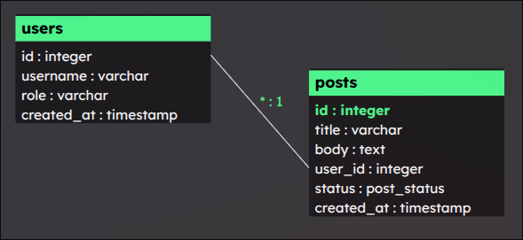

*Semestrální práce, B0B39KAJ*
# ERD Canvas

**ERD Canvas** je single-page aplikace pro rychlé a intuitivní vytváření Entity-Relationship Diagramů (ERD) přímo v prohlížeči.

 **Demo aplikace je nasazeno pomocí [Github Pages](https://dev.kindl.cz/ERD-Canvas/).**


## 📝 Obsah dokumentace

1. [Přehled](#přehled)
2. [Hlavní funkce](#hlavní-funkce)
3. [Použití](#použití)
4. [Příklady](#příklady)

## Přehled
ERD Canvas umožňuje psát databázové schéma v jednoduchém textovém formátu DBML a zároveň ho vizualizovat jako interaktivní ERD. Díky tomu není potřeba instalovat žádný desktopový nástroj nebo dokonce mít připojení k internetu pro tvorbu a prohlížení diagramu.


## Hlavní funkce

- **Hash-based SPA routing**
  - Navigace mezi domovskou stránkou a editorem bez nutnosti plného reloadu.
- **Editor DBML**
  - Textové pole s číslováním řádků.
  - Debounce parsování (400 ms) pro plynulé psaní.
  - Zvýraznění a počítání syntaktických chyb.
- **Live rendering ERD**
  - Diagram se aktualizuje při změně DBML v reálném čase.
- **Manipulace s diagramem**
  - Zoom in/out, drag & pan myší.
- **Ukládání stavu**
  - Stav editoru a JSON struktury se po každé validní změně ukládá do `localStorage`.
- **Online/offline stav**
  - Indikátor v patičce využívá `navigator.onLine` a navázané eventy.
- **Offline podpora**
  - Aplikace je cachovaná přes `ServiceWorker`, takže funguje i bez připojení.


<<<<<<< HEAD
## Použití
Aplikace se odvijí od uživateslkého vstupu v reálném čase. Jako takový stup se očekává řetězec ve formátu DBML ([Database Markup Language](https://dbml.dbdiagram.io/home)). Jakýkoliv takový vstup, se nejprve zvaliduje, pokud validace neproběhne úspěšně, uživateli se zvýrazní číslo řádků (nejen jednoho) který chybu způsobil. Pokud validace proběhla úspěšně, aplikace řetězec zpracuje, a okamžitě ho vykreslí na plátno.

## Příklady

### 1. Platný DBML řetězec a jeho korespondující diagram.
=======
#### Příklad:
Následující DBML řetězec:
>>>>>>> origin/main
```
Table users {
  id integer
  username varchar
  role varchar
  created_at timestamp
}

Table posts {
  id integer PK
  title varchar
  body text
  user_id integer
  created_at timestamp
}

Ref: posts.user_id > users.id // '>' reprezentuje kardinalitu (N:1)
```


---
### 2. Neplatný řetězec, a zvýraznění chyb
Řetězec níže má hned 2 chyby:
- Název atributu "display name" obsahuje mezeru
- Pro ukončení definice tabulky byla použita špatná závarka **')'** místo **'}'**

<<<<<<< HEAD

=======

>>>>>>> origin/main
