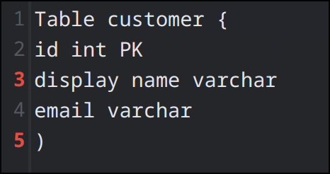

*Semestr치ln칤 pr치ce, B0B39KAJ*
# ERD Canvas

**ERD Canvas** je single-page aplikace pro rychle패 a intuitivni패 vytv치콏en칤 Entity-Relationship Diagram콢 (ERD) p콏칤mo v prohl칤쬰캜i.

 **Demo aplikace je nasazeno pomoc칤 [Github Pages](https://dev.kindl.cz/ERD-Canvas/).**


## 游닇 Obsah dokumentace

1. [P콏ehled](#p콏ehled)
2. [Hlavn칤 funkce](#hlavn칤-funkce)
3. [Pou쬴t칤](#pou쬴t칤)
4. [P콏칤klady](#p콏칤klady)

## P콏ehled
ERD Canvas umo쮄갓je ps치t datab치zov칠 sch칠ma v jednoduch칠m textov칠m form치tu DBML a z치rove켿 ho vizualizovat jako interaktivn칤 ERD. D칤ky tomu nen칤 pot콏eba instalovat 쮂멳n칳 desktopov칳 n치stroj nebo dokonce m칤t p콏ipojen칤 k internetu pro tvorbu a prohl칤쬰n칤 diagramu.


## Hlavn칤 funkce

- **Hash-based SPA routing**
  - Navigace mezi domovskou str치nkou a editorem bez nutnosti pln칠ho reloadu.
- **Editor DBML**
  - Textov칠 pole s 캜칤slov치n칤m 콏치dk콢.
  - Debounce parsov치n칤 (400 ms) pro plynul칠 psan칤.
  - Zv칳razn캩n칤 a po캜칤t치n칤 syntaktick칳ch chyb.
- **Live rendering ERD**
  - Diagram se aktualizuje p콏i zm캩n캩 DBML v re치ln칠m 캜ase.
- **Manipulace s diagramem**
  - Zoom in/out, drag & pan my코칤.
- **Ukl치d치n칤 stavu**
  - Stav editoru a JSON struktury se po ka쬯칠 validn칤 zm캩n캩 ukl치d치 do `localStorage`.
- **Online/offline stav**
  - Indik치tor v pati캜ce vyu쮂셨치 `navigator.onLine` a nav치zan칠 eventy.
- **Offline podpora**
  - Aplikace je cachovan치 p콏es `ServiceWorker`, tak쬰 funguje i bez p콏ipojen칤.


<<<<<<< HEAD
## Pou쬴t칤
Aplikace se odvij칤 od u쬴vateslk칠ho vstupu v re치ln칠m 캜ase. Jako takov칳 stup se o캜ek치v치 콏et캩zec ve form치tu DBML ([Database Markup Language](https://dbml.dbdiagram.io/home)). Jak칳koliv takov칳 vstup, se nejprve zvaliduje, pokud validace neprob캩hne 칰sp캩코n캩, u쬴vateli se zv칳razn칤 캜칤slo 콏치dk콢 (nejen jednoho) kter칳 chybu zp콢sobil. Pokud validace prob캩hla 칰sp캩코n캩, aplikace 콏et캩zec zpracuje, a okam쬴t캩 ho vykresl칤 na pl치tno.

## P콏칤klady

### 1. Platn칳 DBML 콏et캩zec a jeho koresponduj칤c칤 diagram.
=======
#### P콏칤klad:
N치sleduj칤c칤 DBML 콏et캩zec:
>>>>>>> origin/main
```
Table users {
  id integer
  username varchar
  role varchar
  created_at timestamp
}

Table posts {
  id integer PK
  title varchar
  body text
  user_id integer
  created_at timestamp
}

Ref: posts.user_id > users.id // '>' reprezentuje kardinalitu (N:1)
```


---
### 2. Neplatn칳 콏et캩zec, a zv칳razn캩n칤 chyb
콎et캩zec n칤쬰 m치 hned 2 chyby:
- N치zev atributu "display name" obsahuje mezeru
- Pro ukon캜en칤 definice tabulky byla pou쬴ta 코patn치 z치varka **')'** m칤sto **'}'**

<<<<<<< HEAD

=======

>>>>>>> origin/main
